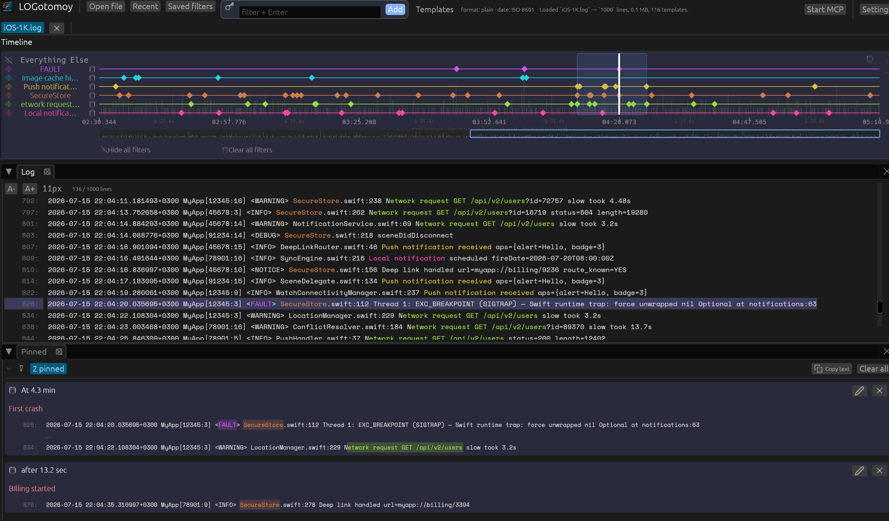
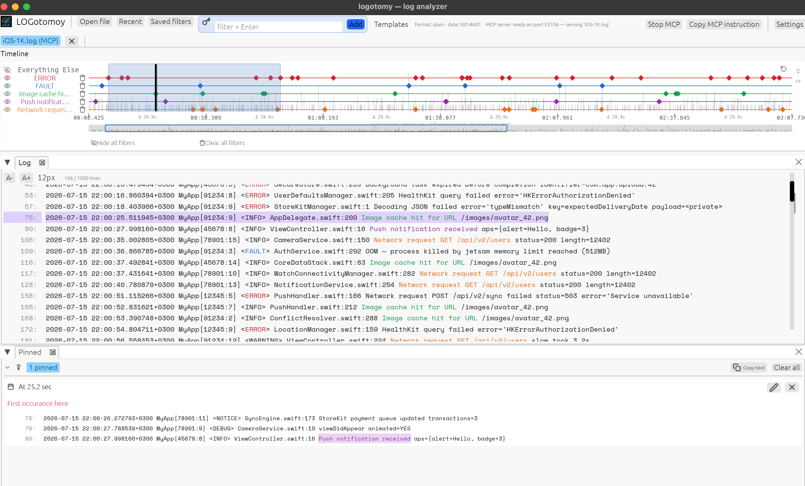

<div align="center">
  

  # logotomy

  Surgically extracting the chaos from giant, mind-numbing log files—giving developers clear visual cues and enabling AI agents to process data in a highly token-efficient manner.

  <p>
    <a href="https://github.com/muntasir-kabir/logotomy/releases">Download</a> ·
    <a href="UserGuide.md">User guide</a> ·
    <a href="docs/mcp.md">MCP server</a> ·
    <a href="feature.md">Feature inventory</a>
  </p>

  <p>
    <a href="https://github.com/muntasir-kabir/logotomy/actions/workflows/rust.yml"></a>
    <a href="LICENSE"></a>
    <a href="https://www.rust-lang.org/"></a>
  </p>
</div>

<div align="center">
  <table>
    <tr>
      <td></td>
      <td></td>
    </tr>
  </table>
</div>

Does anyone really read long logs anymore?
**For AI agents,** built-in MCP tools keep token usage low and improve understanding.
**For humans,** developer-friendly visual cues make long log files easier to understand and analyze.

**If you are a developer** and this tool is helpful, **star** it, feel free to **contribute**, and share **suggestions** in **issues/comments**. More than 90% of the code is AI-generated anyway, so extending it isn't hard.

**CHEERS!**


_:The rest of this README was written with AI assistance:_


## Why logotomy?

Large logs are not just long text files. They are timelines, repeated event shapes, bursts,
gaps, and a handful of lines that explain the whole incident.

logotomy loads a file, detects what it can, mines recurring templates, and puts the structure
on screen. Add a few keywords, see where they cluster, jump to an occurrence, inspect its
context, and keep the useful lines around while you investigate.

It is deliberately a desktop tool, not a hosted log platform. There is no ingestion pipeline,
no account, no dashboard backend, and no claim that a heuristic can replace your judgment.
The goal is a focused local tool that helps you get from **“something went wrong”** to **“this
is where it went wrong”** quickly.

## What it can do

### Analyze without swallowing the whole file

- Open `.log`, `.txt`, `.out`, `.csv`, and other text files; the extension does not matter.
- Use memory-mapped I/O so large files are paged by the operating system instead of copied wholesale.
- Build a line index in one fast pass, with cancellable progress for indexing and analysis.
- Handle CRLF, missing final newlines, blank lines, invalid UTF-8, files without timestamps, and very long lines.

### Understand common log shapes

- Detect and normalize JSON, CEF, RFC 5424, Apple Unified Logging, logcat brief,
  iOS OSLog console, and plain-text logs.
- Detect common timestamp families including ISO 8601, syslog, Apache, epoch, logcat,
  and glog timestamps.
- Carry timestamps through stack traces and continuation lines.
- Mine recurring message templates in native Rust with Drain-style parsing, replacing dynamic
  values with wildcards and assigning each line a template ID.

### Explore the incident visually

- Open multiple files in tabs and drag files directly onto the window.
- Browse a virtualized log view with line numbers, template IDs, inline match highlights,
  selection, context, pins, and notes.
- Add up to 20 keyword filters; matching runs in the background and filters are color-coded.
- See density over the whole file in a timeline with one lane per filter plus **Everything Else**.
- Toggle lanes, jump to nearby matches, zoom, pan, brush-select a range, and use the minimap.
- Browse mined templates by frequency and jump to an example occurrence.
- Switch between dark and light themes; adjust the embedded Space Mono log font from 8–24 px.

### Give AI assistants a local, structured view of the log

The same binary includes an [MCP (Model Context Protocol) server](docs/mcp.md). It can run over
stdio for a coding agent or over local HTTP for clients that need a socket. In GUI mode, it can
run in-process and share the files already open in the app—so the visual investigation and the
programmatic investigation use the same loaded document.

Available tools include:

- `load_log`, `list_logs`, and `close_log`
- `find_occurrences` with pagination, context, and first/last-seen information
- `summarize_log` and `get_timeline_histogram`
- `get_template`, `get_template_samples`, and `get_template_anomalies`
- `log_sequence` for compact time/line/template triples
- `raw_log` for exact lines in a line or time range
- `filters_get`, `filters_add`, and `filters_remove`

## Install

Download the latest native installer from [GitHub Releases](https://github.com/muntasir-kabir/logotomy/releases):

| Platform | Package |
| --- | --- |
| macOS | `.dmg` for Apple Silicon or Intel |
| Ubuntu/Linux x86_64 | `.deb` or `.AppImage` |
| Windows x86_64 | NSIS `.exe` installer |

Releases are built by GitHub Actions when a `v*` tag is pushed. Each release also includes
SHA-256 checksums. If you prefer to build from source, see below.

## Build from source

You need a current [Rust toolchain](https://rustup.rs/) (Rust 1.85+ is used by the project docs).

```bash
git clone https://github.com/muntasir-kabir/logotomy.git
cd logotomy

# Build and run the GUI in release mode
cargo run --release

# Build the binary only
cargo build --release
```

The default build includes the GUI and MCP server. The resulting binary is
`target/release/logotomy` (or `logotomy.exe` on Windows).

For a headless MCP-only build:

```bash
cargo build --release --no-default-features
```

## A three-minute tour

1. **Open a file.** Drop a text log onto the window or choose **Open file**. Indexing and
   template mining happen in the background with progress you can cancel.
2. **Add a question.** Enter a keyword such as `ERROR`, `timeout`, or `user_id=42` and press
   Enter. The match count and colored timeline lane will appear as the scan finishes.
3. **Find the shape of the incident.** Use the timeline to spot bursts and gaps. Scroll to zoom,
   drag to pan, Shift-drag to select a range, or click a match to jump into the log.
4. **Keep context.** Select a line, inspect the surrounding context, then right-click to pin the
   line or add an analysis note. Click a template in the right panel to find a representative
   occurrence.
5. **Change the lens.** Toggle filter lanes to focus the log view, switch the theme, or open
   another file in a tab.

For the full interaction and keyboard/mouse reference, read the [User Guide](UserGuide.md).

## MCP quick start

### Stdio: coding agents and local clients

The simplest integration is to let your client spawn logotomy:

```bash
logotomy --mcp
```

The server speaks newline-delimited JSON-RPC 2.0 over stdin/stdout. If your client needs a
configuration entry, the shape is:

```json
{
  "mcpServers": {
    "logotomy": {
      "command": "/absolute/path/to/logotomy",
      "args": ["--mcp"]
    }
  }
}
```

### HTTP: local tools and extensions

```bash
logotomy --mcp --port 9876
```

This binds the headless server locally and exposes the MCP HTTP transport. For the GUI-managed
server, use the **MCP** control in the toolbar or Settings; the GUI displays the connection URL
and a per-session secret path.

For protocol details, tool arguments, ranges, filtering semantics, and a manual JSON-RPC smoke
test, see [`docs/mcp.md`](docs/mcp.md).

## Performance, honestly

The design is optimized for large local files:

- memory-mapped file access rather than eagerly materializing the entire file;
- a fast line-offset index;
- one analysis pipeline for format detection, timestamp extraction, masking, and template mining;
- Aho–Corasick matching for scanning multiple keyword filters in one pass; and
- a virtualized renderer that only draws the rows currently visible.

On the author's M-series MacBook, the included benchmark reports roughly 3.3 seconds to load a
64 MB / 787k-line synthetic log, 0.7 seconds for a three-filter scan, and 13 ms to build the
timeline. Your machine, file shape, storage, and filters will change those numbers. Run the
benchmark on your own workload instead of trusting a README:

```bash
cargo run --release --example bench -- path/to/app.log ERROR timeout
```

With no file argument, the benchmark generates a synthetic log. The GUI caps the displayed
length of an individual line at 2,000 characters; the underlying mapped data remains intact.

## Project status and boundaries

logotomy is an active, opinionated tool—not a finished observability platform. It currently
focuses on local inspection and keyword-driven exploration. Regex filters, export/reporting,
persistent filter sets, merged multi-file timelines, and MCP resources/prompts are not implemented
yet. See the [feature inventory](feature.md) for the current implementation and deliberate next
steps.

## Contributing

Contributions are welcome, especially from developers who work with ugly real-world logs. Good
places to help:

- reproduce a parser or timestamp detector failure with a small, non-sensitive fixture;
- improve the GUI workflow or accessibility of a dense timeline;
- add tests for edge cases and platform behavior;
- improve MCP tool ergonomics and documentation; or
- benchmark a workload that is missing from the current examples.

Before opening a pull request:

```bash
cargo fmt --all -- --check
cargo check --all-targets
cargo test --release
cargo test --release --example gen_ios_logs
```

Please do not commit private logs, credentials, customer identifiers, or generated build output.
For behavior or architecture changes, update the relevant [User Guide](UserGuide.md),
[feature inventory](feature.md), or [MCP documentation](docs/mcp.md) too. Bug fixes and feature
changes should include a regression test where practical.

## Documentation

- [User Guide](UserGuide.md) — installation, GUI walkthrough, controls, MCP examples, and benchmarks
- [Feature inventory](feature.md) — what is implemented, what is not, and the planned direction
- [MCP server reference](docs/mcp.md) — transports, tools, arguments, and security notes
- [Release guide](docs/release.md) — native packaging for macOS, Linux, and Windows
- [AI assistant project notes](AI_ASSISTANT_DETAIL.md) — architecture and repository details
- [Changelog](changes.md)

## License

logotomy is released under the [MIT License](LICENSE).

The log text view embeds [Space Mono](https://fonts.google.com/specimen/Space+Mono) by The Space
Mono Project Authors under the [SIL Open Font License 1.1](https://openfontlicense.org/). The font
license and original files are included in `src/ui/fonts/Space_Mono/`.

